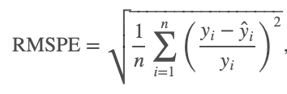

# Data Science Retreat July 2019 Mini Competition

The mini-competition allows Data Science Retreat participants to complete a start to finish data science project. 

Participants will receive training data (in CSV format) and a supplementary dataset.

```
#  store.csv
Index(['Store', 'StoreType', 'Assortment', 'CompetitionDistance',
       'CompetitionOpenSinceMonth', 'CompetitionOpenSinceYear', 'Promo2',
       'Promo2SinceWeek', 'Promo2SinceYear', 'PromoInterval'],
      dtype='object')

#  train.csv
Index(['Unnamed: 0', 'Unnamed: 0.1', 'Store', 'DayOfWeek', 'Date', 'Sales',
       'Customers', 'Open', 'Promo', 'StateHoliday', 'SchoolHoliday'],
      dtype='object')
```

On the final day, participants will receive a test data CSV in the same format (same columns, etc) as the training CSV (but without the target `Sales`).

## Scoring Criteria

The competition is scored based on a composite of predictive accuracy and reproducibility.

## Predictive accuracy

The task is to predict the `Sales` of a given store on a given day.

Submissions are evaluated on the root mean square percentage error (RMSPE):



Zero sales days are ignored in scoring.

The team scores will be ranked - the highest score (lowest RMSPE) will receive a score of 10 for the scoring criteria section.

Each lower score (higher RMSPE) will receive a score of 10-(1 * number in ranking). If they are ranked second, score will be 10-2 = 8. 

## Reproducibility

The entire model should be completely reproducible - to score this Adam/Rachel will clone your repository and follow the instructions as per the readme.  All teams start out with a score of 10.  One point is deducted for each step not included in the repo.

## Advice

Commit early and often

Visualize early

Ensemble

Look at the predictions your model is getting wrong - can you engineer a feature for those samples?

A well tuned random forest should be the baseline
